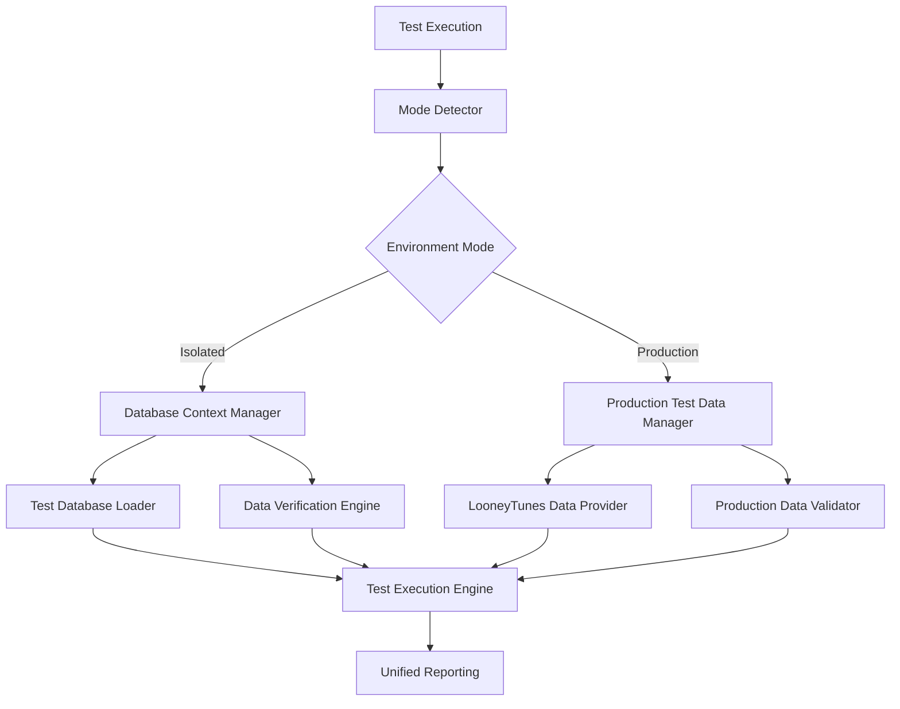
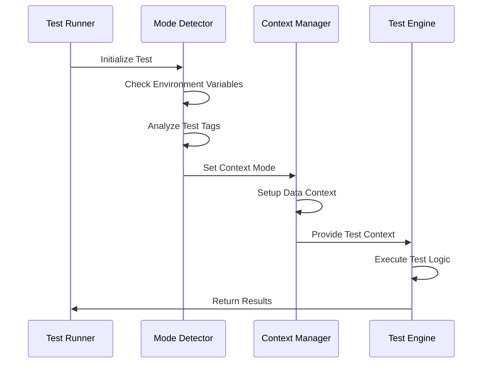

# Design Document

## Overview

The dual testing architecture enables seamless execution of tests in both isolated database environments and live production environments using identifiable test data. The system extends the existing Cucumber/Playwright framework to support automatic mode detection, data context switching, and consistent test execution across environments.

## Architecture

### Core Components



### Environment Detection Flow



## Components and Interfaces

### 1. Mode Detection System

**TestModeDetector**
- Analyzes environment variables (`TEST_MODE`, `NODE_ENV`)
- Examines test tags (`@isolated`, `@production`, `@dual`)
- Provides fallback to isolated mode
- Validates mode compatibility with test requirements

**Interface:**
```typescript
interface TestModeDetector {
  detectMode(testContext: TestContext): TestMode;
  validateModeCompatibility(mode: TestMode, test: TestDefinition): boolean;
  getDefaultMode(): TestMode;
}

enum TestMode {
  ISOLATED = 'isolated',
  PRODUCTION = 'production',
  DUAL = 'dual'
}
```

### 2. Data Context Management

**DatabaseContextManager** (Isolated Mode)
- Loads predefined database states from backup files
- Manages database snapshots and restoration
- Provides data verification utilities
- Handles cleanup after test execution

**ProductionTestDataManager** (Production Mode)
- Manages looneyTunesTest entities (customers, routes, tickets)
- Validates test data existence and integrity
- Creates missing test entities when needed
- Ensures data follows naming conventions

**Interface:**
```typescript
interface DataContextManager {
  setupContext(mode: TestMode, testConfig: TestConfig): Promise<DataContext>;
  validateContext(context: DataContext): Promise<boolean>;
  cleanupContext(context: DataContext): Promise<void>;
}

interface DataContext {
  mode: TestMode;
  testData: TestDataSet;
  connectionInfo: ConnectionInfo;
  cleanup: () => Promise<void>;
}
```

### 3. Test Data Providers

**IsolatedDataProvider**
- Loads database dumps from `.kiro/test-data/isolated/`
- Provides data verification queries
- Manages test database connections
- Supports multiple database states per test scenario

**LooneyTunesDataProvider**
- Manages production test customers (Bugs Bunny, Daffy Duck, etc.)
- Handles test routes (Cedar Falls, Winfield, O'Fallon)
- Creates and maintains test tickets
- Ensures data visibility for human operators

### 4. Test Execution Engine

**DualModeTestRunner**
- Extends existing Cucumber hooks
- Injects appropriate data context before test execution
- Maintains consistent test logic across modes
- Provides mode-specific reporting and debugging

## Data Models

### Test Configuration
```typescript
interface TestConfig {
  mode: TestMode;
  databaseConfig?: DatabaseConfig;
  productionConfig?: ProductionConfig;
  tags: string[];
  retries: number;
  timeout: number;
}

interface DatabaseConfig {
  backupPath: string;
  connectionString: string;
  restoreTimeout: number;
  verificationQueries: string[];
}

interface ProductionConfig {
  testDataPrefix: string; // 'looneyTunesTest'
  locations: string[]; // ['Cedar Falls', 'Winfield', "O'Fallon"]
  customerNames: string[]; // Looney Tunes characters
  cleanupPolicy: 'preserve' | 'cleanup' | 'archive';
}
```

### Test Data Models
```typescript
interface TestDataSet {
  customers: TestCustomer[];
  routes: TestRoute[];
  tickets: TestTicket[];
  metadata: TestMetadata;
}

interface TestCustomer {
  id: string;
  name: string; // e.g., "Bugs Bunny - looneyTunesTest"
  email: string;
  phone: string;
  isTestData: boolean;
}

interface TestRoute {
  id: string;
  name: string;
  location: string; // Cedar Falls, Winfield, O'Fallon
  isTestData: boolean;
}
```

## Error Handling

### Error Categories
1. **Mode Detection Errors**: Invalid environment configuration, conflicting test tags
2. **Data Context Errors**: Database connection failures, missing test data
3. **Test Execution Errors**: Runtime failures with context information
4. **Cleanup Errors**: Failed restoration or cleanup operations

### Error Recovery Strategies
- **Graceful Degradation**: Fall back to isolated mode if production data unavailable
- **Retry Logic**: Automatic retry for transient database/network issues
- **Context Preservation**: Maintain test context information in error reports
- **Cleanup Guarantee**: Ensure cleanup runs even after test failures

### Error Reporting
```typescript
interface TestError extends Error {
  mode: TestMode;
  context: DataContext;
  testId: string;
  recoveryAction?: string;
  cleanupRequired: boolean;
}
```

## Testing Strategy

### Unit Testing
- Test mode detection logic with various environment configurations
- Validate data context setup and cleanup procedures
- Test error handling and recovery mechanisms
- Mock external dependencies (databases, APIs)

### Integration Testing
- Test complete workflow from mode detection to cleanup
- Validate database loading and restoration processes
- Test production test data creation and management
- Verify cross-mode test execution consistency

### End-to-End Testing
- Run existing test suites in both modes
- Validate that refactored tests produce consistent results
- Test mode switching and environment detection
- Verify reporting and debugging capabilities

### Test Data Management
- Maintain isolated test database snapshots
- Create and maintain production test entities
- Validate test data integrity across environments
- Implement test data versioning and migration

## Implementation Phases

### Phase 1: Core Infrastructure
- Implement mode detection system
- Create data context management framework
- Set up basic isolated database loading
- Establish production test data patterns

### Phase 2: Data Providers
- Implement isolated data provider with database loading
- Create looneyTunes data provider for production testing
- Add data validation and integrity checks
- Implement cleanup and restoration mechanisms

### Phase 3: Test Integration
- Extend Cucumber hooks for dual-mode support
- Modify existing page objects for context awareness
- Update step definitions for mode-agnostic execution
- Add mode-specific reporting and debugging

### Phase 4: Test Refactoring
- Convert existing navigation tests to dual-mode
- Refactor API tests for both environments
- Update customer management tests
- Migrate all feature files to new architecture

### Phase 5: Validation and Optimization
- Comprehensive testing of both modes
- Performance optimization for database operations
- Documentation and team training
- Monitoring and maintenance procedures