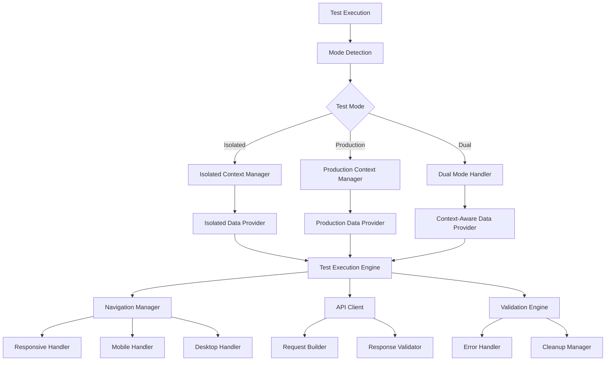
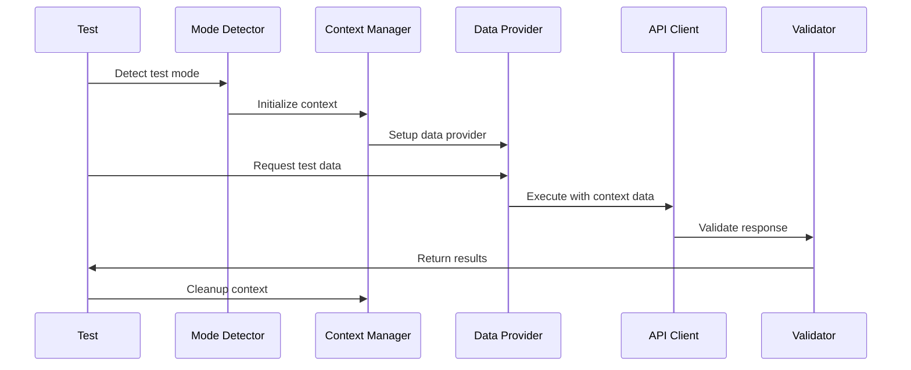

# Design Document

## Overview

This design addresses the systematic migration of failing tests to the dual testing architecture. The solution focuses on fixing production mode initialization, implementing context-aware data management, improving navigation reliability, and ensuring proper error handling across all test scenarios.

## Architecture

### Core Components



### Data Flow Architecture



## Components and Interfaces

### 1. Enhanced Mode Detection System

```typescript
interface ModeDetector {
  detectMode(scenario: TestScenario): TestMode;
  validateModeConfiguration(mode: TestMode): ValidationResult;
  getFallbackMode(primaryMode: TestMode): TestMode | null;
}

interface TestModeConfiguration {
  primaryMode: TestMode;
  fallbackMode?: TestMode;
  environmentVariables: Record<string, string>;
  databaseConfig: DatabaseConfiguration;
  timeouts: TimeoutConfiguration;
}
```

**Key Features:**
- Robust mode detection with fallback mechanisms
- Configuration validation before test execution
- Environment variable validation and defaults
- Database connectivity verification

### 2. Context-Aware Data Management

```typescript
interface DataContextManager {
  setupContext(mode: TestMode, config: TestConfiguration): Promise<DataContext>;
  getContextualData(dataType: string, identifier: string): Promise<any>;
  createTestData(template: DataTemplate): Promise<CreatedData>;
  validateTestData(data: any): ValidationResult;
  cleanup(): Promise<void>;
}

interface DataProvider {
  getCustomerId(baseName?: string): string;
  getTicketId(baseName?: string): string;
  getRouteId(baseName?: string): string;
  generateTestEntity(type: EntityType, properties?: any): TestEntity;
}
```

**Key Features:**
- Mode-specific data generation
- Automatic ID resolution based on context
- Validation of data existence before use
- Proper cleanup of created test data

### 3. Enhanced Navigation System

```typescript
interface NavigationManager {
  navigateToPage(pageName: string, options?: NavigationOptions): Promise<void>;
  clickNavigationLink(linkName: string): Promise<void>;
  validateResponsiveness(viewport: ViewportType): Promise<boolean>;
  handleMobileNavigation(target: string): Promise<void>;
  waitForPageLoad(expectedUrl?: string): Promise<void>;
}

interface NavigationStrategy {
  getSelectors(target: string): string[];
  getWaitConditions(target: string): WaitCondition[];
  getRetryOptions(): RetryOptions;
}
```

**Key Features:**
- Multiple selector strategies for navigation elements
- Progressive timeout handling
- Viewport-specific navigation logic
- Comprehensive error reporting with screenshots

### 4. API Client Enhancement

```typescript
interface ContextAwareAPIClient {
  get(endpoint: string, params?: any): Promise<APIResponse>;
  post(endpoint: string, data: any): Promise<APIResponse>;
  put(endpoint: string, data: any): Promise<APIResponse>;
  delete(endpoint: string): Promise<APIResponse>;
  buildContextualRequest(template: RequestTemplate): APIRequest;
}

interface RequestBuilder {
  buildTicketRequest(data: TicketData): APIRequest;
  buildCustomerRequest(data: CustomerData): APIRequest;
  resolveContextualIds(data: any): any;
}
```

**Key Features:**
- Automatic ID resolution for API requests
- Context-aware request building
- Response validation with mode-specific criteria
- Detailed logging for debugging

## Data Models

### Test Context Model

```typescript
interface TestContext {
  mode: TestMode;
  testId: string;
  dataProvider: DataProvider;
  configuration: TestConfiguration;
  createdEntities: CreatedEntity[];
  startTime: Date;
}

interface CreatedEntity {
  type: EntityType;
  id: string;
  data: any;
  createdAt: Date;
  needsCleanup: boolean;
}
```

### Configuration Model

```typescript
interface TestConfiguration {
  mode: TestMode;
  database: DatabaseConfig;
  api: APIConfig;
  ui: UIConfig;
  timeouts: TimeoutConfig;
  retries: RetryConfig;
}

interface TimeoutConfig {
  pageLoad: number;
  apiRequest: number;
  elementWait: number;
  navigationWait: number;
  databaseOperation: number;
}
```

### Data Template Model

```typescript
interface DataTemplate {
  type: EntityType;
  mode: TestMode;
  properties: Record<string, any>;
  relationships?: EntityRelationship[];
}

interface EntityRelationship {
  type: string;
  targetType: EntityType;
  targetId?: string;
  required: boolean;
}
```

## Error Handling

### Error Classification System

```typescript
enum ErrorType {
  CONFIGURATION_ERROR = 'configuration_error',
  DATA_ERROR = 'data_error',
  NAVIGATION_ERROR = 'navigation_error',
  API_ERROR = 'api_error',
  TIMEOUT_ERROR = 'timeout_error',
  VALIDATION_ERROR = 'validation_error'
}

interface TestError {
  type: ErrorType;
  message: string;
  context: ErrorContext;
  suggestions: string[];
  recoverable: boolean;
}
```

### Recovery Strategies

1. **Configuration Errors**: Provide step-by-step setup instructions
2. **Data Errors**: Suggest data creation or validation steps
3. **Navigation Errors**: Try alternative selectors and strategies
4. **API Errors**: Retry with exponential backoff
5. **Timeout Errors**: Increase timeouts and provide performance metrics
6. **Validation Errors**: Show detailed comparison with expected values

## Testing Strategy

### Test Categories and Migration Approach

1. **Navigation Tests**
   - Fix selector strategies
   - Implement progressive timeouts
   - Add mobile navigation support
   - Enhance responsiveness validation

2. **API Tests**
   - Implement context-aware data resolution
   - Add proper error handling
   - Fix hardcoded ID usage
   - Add response validation

3. **Production Mode Tests**
   - Fix initialization issues
   - Validate looneyTunesTest data existence
   - Implement proper fallback mechanisms
   - Add comprehensive error reporting

4. **Dual Mode Tests**
   - Ensure consistent behavior across modes
   - Implement mode-appropriate assertions
   - Add cross-mode validation
   - Fix timeout and performance issues

### Migration Phases

**Phase 1: Infrastructure Fixes**
- Fix production mode initialization
- Implement robust mode detection
- Add comprehensive error handling
- Set up proper logging and diagnostics

**Phase 2: Data Management**
- Implement context-aware data providers
- Fix hardcoded ID usage in API tests
- Add data validation and cleanup
- Create production test data validation

**Phase 3: Navigation Improvements**
- Fix navigation timeout issues
- Implement multiple selector strategies
- Add mobile navigation support
- Enhance responsiveness validation

**Phase 4: Validation and Cleanup**
- Add comprehensive test validation
- Implement proper cleanup mechanisms
- Add performance monitoring
- Create diagnostic tools

## Implementation Considerations

### Performance Optimizations

1. **Database Loading**: Implement incremental loading and caching
2. **API Requests**: Use connection pooling and request batching
3. **UI Operations**: Implement smart waiting and element caching
4. **Test Execution**: Parallel execution where safe

### Security Considerations

1. **Production Data**: Ensure only looneyTunesTest entities are affected
2. **API Access**: Validate permissions for each test mode
3. **Data Cleanup**: Implement secure deletion of test data
4. **Error Logging**: Sanitize sensitive information in logs

### Monitoring and Diagnostics

1. **Test Metrics**: Track success rates, execution times, and failure patterns
2. **Error Reporting**: Comprehensive error context and suggestions
3. **Performance Monitoring**: Database load times, API response times
4. **Health Checks**: Validate test environment health before execution

## Success Criteria

1. **All 40 failing tests pass** in their appropriate modes
2. **Production mode initialization** works reliably
3. **API tests use context-appropriate data** without hardcoded values
4. **Navigation tests work consistently** across all viewports
5. **Error messages are clear and actionable** for debugging
6. **Test execution time** remains within acceptable limits
7. **Data cleanup** works properly in all scenarios
8. **Cross-mode consistency** is maintained for dual-tagged tests