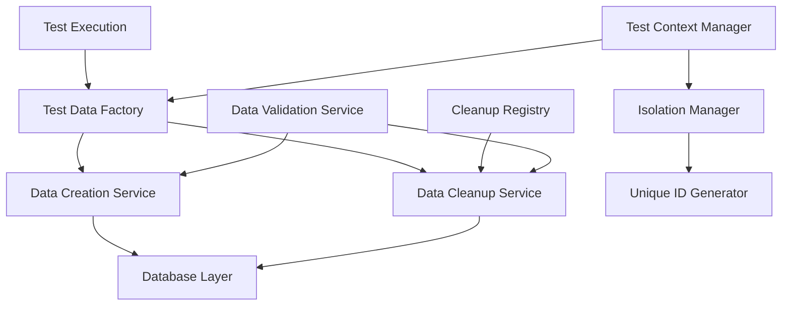
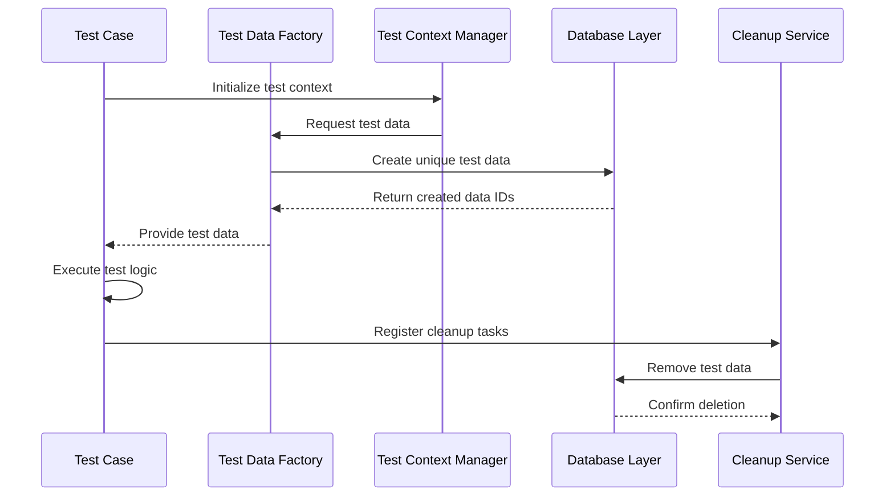

# Design Document

## Overview

This design addresses the critical issue of test data dependencies by implementing a comprehensive test data independence system that integrates seamlessly with the existing dual-testing architecture. The solution transforms the current brittle test suite that relies on pre-existing database state into a robust, self-contained testing framework where each test creates and manages its own data lifecycle while maintaining compatibility with both isolated and production testing modes.

The design leverages existing infrastructure (ProductionTestDataManager, GeographicTestDataGenerator, dual-testing patterns) while introducing new components for data isolation, cleanup, and factory-based test data creation that respect the established looneyTunesTest naming conventions and dual-mode execution patterns.

## Architecture

### Core Components



### Data Flow Architecture



## Components and Interfaces

### 1. Dual-Mode Test Data Factory System

**TestDataFactory Interface**
```typescript
interface TestDataFactory {
  createCustomers(count: number, mode: TestMode, options?: CustomerOptions): Promise<Customer[]>;
  createTickets(count: number, mode: TestMode, options?: TicketOptions): Promise<Ticket[]>;
  createRoutes(count: number, mode: TestMode, options?: RouteOptions): Promise<Route[]>;
  createAssignments(tickets: Ticket[], routes: Route[], mode: TestMode): Promise<Assignment[]>;
  validateTestDataNaming(data: any[], mode: TestMode): ValidationResult;
}

enum TestMode {
  ISOLATED = 'isolated',
  PRODUCTION = 'production'
}
```

**Factory Implementation Strategy**
- Mode-aware data creation following dual-testing patterns
- Production mode enforces looneyTunesTest naming conventions
- Isolated mode uses unique test identifiers for parallel execution
- Parameterized creation with sensible defaults per mode
- Realistic data patterns following business rules and existing conventions

### 2. Dual-Mode Test Context Manager

**TestContextManager Class**
```typescript
class TestContextManager {
  private testId: string;
  private testMode: TestMode;
  private createdData: Map<string, any[]>;
  private cleanupTasks: CleanupTask[];
  private productionSafetyValidator: ProductionSafetyValidator;
  
  async initializeContext(testName: string, tags: string[]): Promise<TestContext>;
  async detectTestMode(tags: string[]): Promise<TestMode>;
  async registerCreatedData(type: string, data: any[]): Promise<void>;
  async scheduleCleanup(task: CleanupTask): Promise<void>;
  async executeCleanup(): Promise<void>;
  async validateProductionSafety(operation: TestOperation): Promise<void>;
}
```

**Responsibilities**
- Auto-detect test mode from @isolated, @production, @dual tags
- Generate appropriate identifiers per mode (unique IDs vs looneyTunesTest names)
- Track all created test data with mode-specific validation
- Manage cleanup task scheduling with production safety checks
- Provide test isolation boundaries respecting dual-testing patterns

### 3. Dual-Mode Data Isolation Manager

**IsolationManager Class**
```typescript
class IsolationManager {
  generateUniquePrefix(testId: string, mode: TestMode): string;
  createIsolatedName(baseName: string, testId: string, mode: TestMode): string;
  createProductionTestName(baseName: string, character: string): string;
  validateDataIsolation(data: any[], testId: string, mode: TestMode): ValidationResult;
  validateLooneyTunesNaming(data: any[]): ValidationResult;
}
```

**Isolation Strategy**
- **Isolated Mode**: Timestamp-based unique prefixes (e.g., "test_1699123456_customer_name")
- **Production Mode**: looneyTunesTest naming convention (e.g., "Bugs Bunny - looneyTunesTest")
- **Email Patterns**: character.lastname@looneytunestest.com for production
- **Route Patterns**: "[Location] Test Route - looneyTunesTest" for production
- Validation to ensure data doesn't conflict with other tests or real production data

### 4. Cleanup Service

**CleanupService Class**
```typescript
class CleanupService {
  async registerCleanupTask(task: CleanupTask): Promise<void>;
  async executeCleanup(testId: string): Promise<CleanupResult>;
  async forceCleanupAll(): Promise<CleanupResult>;
  async validateCleanupCompletion(testId: string): Promise<boolean>;
}
```

**Cleanup Strategies**
- Immediate cleanup after each test
- Batch cleanup for performance optimization
- Orphaned data detection and removal
- Cleanup failure recovery mechanisms

### 5. Enhanced Dual-Mode Step Definitions

**Mode-Aware Data Creation Steps**
```gherkin
Given I have {int} test customers for this test mode
Given I have {int} test tickets in {string} area following naming conventions
Given I have {int} test routes with capacity {int} each using proper test naming
Given I have test assignments between tickets and routes with cleanup tracking
Given there are looneyTunesTest customers in the system  # Production mode
Given there are test tickets with unique identifiers     # Isolated mode
```

**Dual-Mode Validation Steps**
```gherkin
Then all created test data should follow the current mode conventions
Then test data cleanup should complete successfully without affecting real data
Then no test data should remain in the database after cleanup
Then production test data should follow looneyTunesTest naming conventions
Then isolated test data should have unique identifiers for this test run
```

**Mode Detection Steps**
```gherkin
Given the system is properly configured for dual testing
When I detect the current test mode from tags
Then the appropriate data creation strategy should be used
```

## Data Models

### Test Context Model
```typescript
interface TestContext {
  testId: string;
  testName: string;
  createdAt: Date;
  dataRegistry: DataRegistry;
  cleanupTasks: CleanupTask[];
  isolationPrefix: string;
}

interface DataRegistry {
  customers: string[];
  tickets: string[];
  routes: string[];
  assignments: string[];
  locations: string[];
}
```

### Cleanup Task Model
```typescript
interface CleanupTask {
  id: string;
  type: 'delete' | 'update' | 'restore';
  entityType: string;
  entityIds: string[];
  priority: number;
  retryCount: number;
  maxRetries: number;
}
```

### Factory Options Models
```typescript
interface CustomerOptions {
  namePrefix?: string;
  addressPattern?: string;
  serviceArea?: string;
  testMarker?: string;
  looneyTunesCharacter?: string; // For production mode
  emailDomain?: string; // Defaults to looneytunestest.com in production
}

interface TicketOptions {
  priorityDistribution?: PriorityDistribution;
  locationBounds?: GeographicBounds;
  statusFilter?: TicketStatus[];
  testMarker?: string;
  assignToTestRoutes?: boolean; // Only assign to test routes in production
}

interface RouteOptions {
  capacityRange?: [number, number];
  serviceAreas?: string[];
  scheduleType?: ScheduleType;
  testMarker?: string;
  locationName?: string; // For production route naming
  testRoutePattern?: boolean; // Use "[Location] Test Route - looneyTunesTest" pattern
}
```

## Error Handling

### Error Recovery Strategies

**Data Creation Failures**
- Retry mechanism with exponential backoff
- Fallback to alternative data generation strategies
- Clear error messages indicating missing dependencies
- Automatic cleanup of partially created data

**Cleanup Failures**
- Multiple cleanup attempts with different strategies
- Orphaned data detection and reporting
- Manual cleanup procedures documentation
- CI/CD pipeline notifications for cleanup failures

**Isolation Violations**
- Validation checks before test execution
- Conflict detection and resolution
- Test data quarantine for investigation
- Automatic test retry with fresh data

### Error Reporting
```typescript
interface TestDataError {
  type: 'creation' | 'cleanup' | 'isolation' | 'validation';
  message: string;
  testId: string;
  entityType?: string;
  entityIds?: string[];
  recoveryActions?: string[];
  timestamp: Date;
}
```

## Testing Strategy

### Unit Testing Approach
- Test data factory method validation
- Cleanup service functionality verification
- Isolation manager unique ID generation
- Error handling scenario coverage

### Integration Testing Strategy
- End-to-end test data lifecycle validation
- Cross-test isolation verification
- Database state consistency checks
- Performance impact measurement

### Test Data Validation
```typescript
interface ValidationSuite {
  validateDataCreation(context: TestContext): Promise<ValidationResult>;
  validateDataIsolation(testId: string): Promise<ValidationResult>;
  validateCleanupCompletion(testId: string): Promise<ValidationResult>;
  validateDatabaseConsistency(): Promise<ValidationResult>;
}
```

### Performance Considerations
- Batch data creation for efficiency
- Parallel cleanup operations where safe
- Connection pooling for database operations
- Caching of frequently used test data patterns

## Implementation Phases

### Phase 1: Core Infrastructure
- Implement TestDataFactory base classes
- Create TestContextManager
- Develop IsolationManager
- Basic cleanup service functionality

### Phase 2: Step Definition Integration
- Update existing step definitions to use factories
- Implement new data creation steps
- Add cleanup registration to all tests
- Create validation steps

### Phase 3: Enhanced Features
- Advanced cleanup strategies
- Performance optimizations
- Comprehensive error handling
- Monitoring and reporting

### Phase 4: Migration and Validation
- Migrate all existing tests
- Validate test independence
- Performance benchmarking
- Documentation and training

## Integration with Existing Dual-Testing Architecture

### Dual-Mode Compatibility
- Seamless integration with existing @isolated, @production, @dual tags
- Respect existing looneyTunesTest naming conventions in production mode
- Maintain compatibility with current ProductionTestDataManager
- Support existing GeographicTestDataGenerator patterns

### Production Safety Integration
```typescript
class ProductionSafetyValidator {
  validateTestOperation(operation: TestOperation, mode: TestMode): void {
    if (mode === TestMode.PRODUCTION) {
      // Ensure operation only affects test data
      if (operation.targetEntity && !this.isTestEntity(operation.targetEntity)) {
        throw new Error(`Operation targets non-test entity: ${operation.targetEntity}`);
      }

      // Validate looneyTunesTest naming conventions
      if (operation.entityName && !operation.entityName.includes('looneyTunesTest')) {
        throw new Error(`Entity name doesn't follow test convention: ${operation.entityName}`);
      }
    }
  }

  private isTestEntity(entity: any): boolean {
    return entity.name?.includes('looneyTunesTest') ||
           entity.email?.includes('looneytunestest.com') ||
           entity.identifier?.startsWith('test-');
  }
}
```

### Existing Test Data Structure Integration
```
.kiro/test-data/
├── isolated/                    # Enhanced with cleanup tracking
│   ├── baseline/
│   ├── scenarios/
│   └── verification/
├── production/                  # New: production test data validation
│   ├── looneyTunesTest-customers.json
│   ├── looneyTunesTest-routes.json
│   └── validation-queries.sql
└── cleanup/                     # New: cleanup tracking and recovery
    ├── cleanup-registry.json
    └── orphaned-data-queries.sql
```

## Migration Strategy

### Backward Compatibility
- Gradual migration approach maintaining existing dual-testing patterns
- Support for both old and new data creation patterns during transition
- Preserve existing looneyTunesTest data in production environment
- Clear migration guidelines for each test type and mode
- Automated migration tools respecting dual-testing conventions

### Risk Mitigation
- Feature flags for new data management system per test mode
- Rollback procedures for failed migrations with mode-specific recovery
- Comprehensive testing of migrated tests in both isolated and production modes
- Monitoring of test execution times and success rates across both modes
- Production safety checks to prevent accidental real data modification