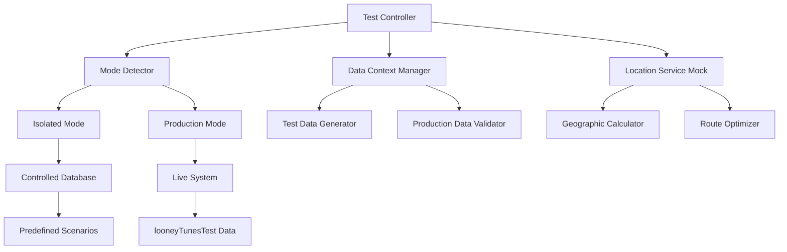

# Design Document

## Overview

The ticket location route assignment testing framework will validate complex business logic involving geographic calculations, route optimization, and real-time data updates. This design leverages the dual testing architecture to ensure both controlled testing of edge cases and validation against real-world data patterns.

## Architecture

### Testing Architecture Components



### Test Mode Strategy

**Isolated Mode:**
- Controlled geographic data with known distances
- Predefined route schedules and capacities
- Deterministic assignment algorithms
- Edge cases like empty routes, full capacity, overlapping coverage

**Production Mode:**
- Real geographic coordinates using test locations
- Live route schedules with test route identifiers
- Actual assignment algorithms with production data
- Integration with mapping services and real-time updates

**Dual Mode:**
- UI navigation and basic functionality
- Assignment workflow validation
- User interface responsiveness
- Basic CRUD operations

## Components and Interfaces

### 1. Location Assignment Test Framework

```typescript
interface LocationAssignmentTestContext {
  mode: TestMode;
  testData: {
    tickets: TestTicket[];
    routes: TestRoute[];
    locations: TestLocation[];
  };
  services: {
    locationService: LocationService;
    routeService: RouteService;
    assignmentService: AssignmentService;
  };
}

interface TestTicket {
  id: string;
  customerId: string;
  location: GeoCoordinate;
  priority: Priority;
  serviceType: ServiceType;
  createdAt: Date;
}

interface TestRoute {
  id: string;
  name: string;
  serviceArea: GeoPolygon;
  capacity: number;
  currentLoad: number;
  schedule: RouteSchedule;
  isTestRoute: boolean;
}
```

### 2. Geographic Test Data Generator

```typescript
class GeographicTestDataGenerator {
  generateTestLocations(mode: TestMode): TestLocation[] {
    if (mode === TestMode.ISOLATED) {
      return this.generateControlledLocations();
    } else {
      return this.generateProductionTestLocations();
    }
  }

  private generateControlledLocations(): TestLocation[] {
    // Known coordinates for predictable distance calculations
    return [
      { name: 'Test Location A', lat: 42.5, lng: -92.5, address: '123 Test St' },
      { name: 'Test Location B', lat: 42.51, lng: -92.51, address: '456 Test Ave' },
      // ... more controlled locations
    ];
  }

  private generateProductionTestLocations(): TestLocation[] {
    // Real coordinates with looneyTunesTest naming
    return [
      { 
        name: 'Bugs Bunny Location - looneyTunesTest', 
        lat: 42.4619, lng: -92.3426, 
        address: '123 Carrot Lane - looneyTunesTest' 
      },
      // ... more production test locations
    ];
  }
}
```

### 3. Assignment Algorithm Validator

```typescript
class AssignmentAlgorithmValidator {
  async validateOptimalAssignment(
    ticket: TestTicket, 
    suggestedRoute: TestRoute,
    context: LocationAssignmentTestContext
  ): Promise<ValidationResult> {
    
    const allRoutes = await context.services.routeService.getAvailableRoutes(ticket.location);
    const distances = await this.calculateDistances(ticket.location, allRoutes);
    
    // Validate that suggested route is optimal or has valid override reason
    const isOptimal = this.isOptimalChoice(suggestedRoute, distances);
    const hasValidOverride = await this.checkOverrideReason(ticket, suggestedRoute);
    
    return {
      isValid: isOptimal || hasValidOverride,
      details: {
        suggestedDistance: distances.get(suggestedRoute.id),
        optimalDistance: Math.min(...distances.values()),
        overrideReason: hasValidOverride ? await this.getOverrideReason(ticket) : null
      }
    };
  }
}
```

## Data Models

### Test Data Structure

```typescript
// Isolated Mode Data Structure
interface IsolatedTestData {
  scenarios: {
    'optimal-assignment': {
      tickets: TestTicket[];
      routes: TestRoute[];
      expectedAssignments: Assignment[];
    };
    'capacity-constraints': {
      tickets: TestTicket[];
      routes: TestRoute[]; // Some at full capacity
      expectedBehavior: 'warning' | 'rejection';
    };
    'bulk-assignment': {
      tickets: TestTicket[]; // Large batch
      routes: TestRoute[];
      expectedDistribution: RouteDistribution;
    };
  };
}

// Production Mode Data Structure
interface ProductionTestData {
  testCustomers: {
    name: string; // Must include 'looneyTunesTest'
    location: GeoCoordinate;
    serviceHistory: ServiceRecord[];
  }[];
  testRoutes: {
    name: string; // Must include 'looneyTunesTest'
    serviceArea: GeoPolygon;
    schedule: RouteSchedule;
  }[];
}
```

### Data Validation Rules

```typescript
class ProductionDataValidator {
  validateTestTicket(ticket: TestTicket): ValidationResult {
    const issues: string[] = [];
    
    // Validate customer naming convention
    if (!ticket.customerName.includes('looneyTunesTest')) {
      issues.push(`Customer name must include 'looneyTunesTest': ${ticket.customerName}`);
    }
    
    // Validate location is in test service area
    if (!this.isInTestServiceArea(ticket.location)) {
      issues.push(`Ticket location outside test service areas`);
    }
    
    // Validate no impact on real customers
    if (this.couldAffectRealCustomers(ticket)) {
      issues.push(`Ticket assignment could impact real customer service`);
    }
    
    return { valid: issues.length === 0, issues };
  }
}
```

## Error Handling

### Assignment Conflict Resolution

```typescript
class AssignmentConflictHandler {
  async handleCapacityConflict(
    ticket: TestTicket, 
    route: TestRoute,
    context: LocationAssignmentTestContext
  ): Promise<ConflictResolution> {
    
    if (context.mode === TestMode.ISOLATED) {
      // In isolated mode, test specific conflict scenarios
      return this.simulateConflictResolution(ticket, route);
    } else {
      // In production mode, use real conflict resolution
      return this.resolveRealConflict(ticket, route);
    }
  }

  private async simulateConflictResolution(
    ticket: TestTicket, 
    route: TestRoute
  ): Promise<ConflictResolution> {
    // Simulate different conflict resolution strategies
    return {
      strategy: 'suggest-alternative-route',
      alternativeRoutes: await this.findAlternativeRoutes(ticket),
      estimatedDelay: this.calculateDelay(ticket, route)
    };
  }
}
```

### Geographic Calculation Error Handling

```typescript
class GeographicCalculationHandler {
  async calculateDistance(
    from: GeoCoordinate, 
    to: GeoCoordinate,
    context: LocationAssignmentTestContext
  ): Promise<number> {
    
    try {
      if (context.mode === TestMode.ISOLATED) {
        // Use deterministic calculation for consistent testing
        return this.calculateEuclideanDistance(from, to);
      } else {
        // Use real routing service for production testing
        return await this.calculateRealDistance(from, to);
      }
    } catch (error) {
      // Fallback to straight-line distance
      console.warn('Distance calculation failed, using fallback:', error);
      return this.calculateEuclideanDistance(from, to);
    }
  }
}
```

## Testing Strategy

### Test Categories

**1. Unit-Level Tests (Isolated Mode)**
- Distance calculation accuracy
- Route capacity validation
- Assignment algorithm logic
- Conflict detection and resolution

**2. Integration Tests (Production Mode)**
- Real mapping service integration
- Database transaction handling
- Real-time notification delivery
- Cross-system data consistency

**3. End-to-End Workflows (Dual Mode)**
- Complete assignment workflow
- Bulk assignment processing
- User interface interactions
- Error message display and handling

### Test Data Management Strategy

```typescript
class TestDataManager {
  async setupTestScenario(
    scenario: string, 
    mode: TestMode
  ): Promise<TestDataContext> {
    
    if (mode === TestMode.ISOLATED) {
      return this.setupIsolatedScenario(scenario);
    } else {
      return this.setupProductionScenario(scenario);
    }
  }

  private async setupIsolatedScenario(scenario: string): Promise<TestDataContext> {
    // Load predefined test data from SQL files
    const data = await this.loadScenarioData(scenario);
    await this.resetDatabase();
    await this.loadTestData(data);
    
    return {
      tickets: data.tickets,
      routes: data.routes,
      expectedResults: data.expectedResults
    };
  }

  private async setupProductionScenario(scenario: string): Promise<TestDataContext> {
    // Ensure production test data exists and is valid
    await this.validateProductionTestData();
    const testData = await this.getProductionTestData();
    
    return {
      tickets: testData.tickets.filter(t => t.customerName.includes('looneyTunesTest')),
      routes: testData.routes.filter(r => r.name.includes('looneyTunesTest')),
      expectedResults: null // Results will vary in production
    };
  }
}
```

### Performance Considerations

**Database Optimization:**
- Use spatial indexes for location queries
- Cache route service area calculations
- Batch assignment operations for bulk processing

**Test Execution Optimization:**
- Parallel execution of independent test scenarios
- Shared test data setup for related tests
- Incremental database updates instead of full resets

**Memory Management:**
- Limit geographic calculation cache size
- Clean up test data after scenario completion
- Use streaming for large bulk assignment tests

## Security Considerations

### Production Data Safety

```typescript
class ProductionSafetyGuard {
  validateAssignmentSafety(assignment: Assignment): void {
    // Ensure assignment only affects test data
    if (!this.isTestCustomer(assignment.customerId)) {
      throw new Error(`Assignment targets non-test customer: ${assignment.customerId}`);
    }
    
    if (!this.isTestRoute(assignment.routeId)) {
      throw new Error(`Assignment targets non-test route: ${assignment.routeId}`);
    }
    
    // Verify no impact on real service delivery
    if (this.couldImpactRealService(assignment)) {
      throw new Error(`Assignment could impact real customer service`);
    }
  }
}
```

### Test Data Isolation

- All test customers must include 'looneyTunesTest' identifier
- Test routes must be clearly marked and isolated from production routes
- Geographic test areas must not overlap with active service areas
- Assignment operations must be reversible and trackable

This design ensures comprehensive testing of the ticket location route assignment feature while maintaining the safety and reliability of the dual testing architecture.