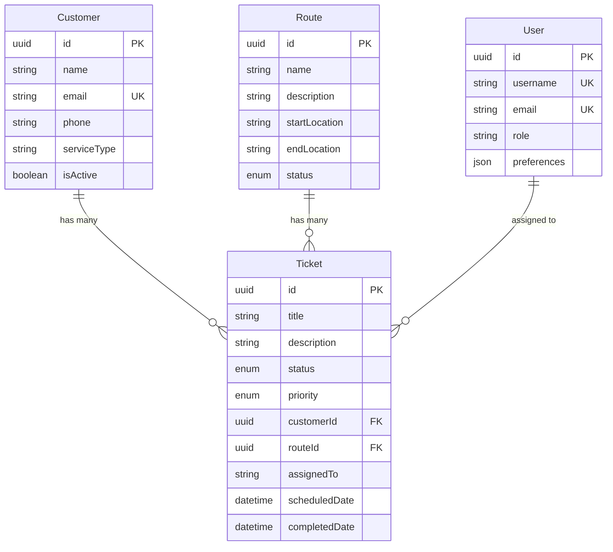

# Data Models Reference

## Overview

This section documents all data models, entity schemas, relationships, and validation rules used in the Local Backend API system.

## Core Entities

### 🎫 [Ticket Model](./ticket.md)
Primary entity for managing service tickets and work orders.

**Key Fields:**
- `id` (UUID) - Unique identifier
- `title` (String) - Ticket title
- `status` (Enum) - Current status
- `priority` (Enum) - Priority level
- `customerId` (UUID) - Associated customer
- `routeId` (UUID) - Associated route

### 👤 [Customer Model](./customer.md)
Entity representing service customers and their information.

**Key Fields:**
- `id` (UUID) - Unique identifier
- `name` (String) - Customer name
- `email` (String) - Email address (unique)
- `phone` (String) - Phone number
- `serviceType` (String) - Type of service

### 🛣️ [Route Model](./route.md)
Entity representing service routes and geographic areas.

**Key Fields:**
- `id` (UUID) - Unique identifier
- `name` (String) - Route name
- `description` (String) - Route description
- `status` (Enum) - Active/inactive status

### 👥 [User Model](./user.md)
Entity for authentication and user management.

**Key Fields:**
- `id` (UUID) - Unique identifier
- `username` (String) - Username (unique)
- `email` (String) - Email address (unique)
- `role` (String) - User role

## Entity Relationships



## Validation Rules

### Common Validation Patterns

**Required Fields**
- All entities require `id`, `createdAt`, `updatedAt`
- Business-specific required fields vary by entity

**Unique Constraints**
- Customer email addresses must be unique
- User usernames and emails must be unique
- Route names should be unique within active routes

**Format Validation**
- Email addresses must follow RFC 5322 format
- Phone numbers accept various formats
- UUIDs must be valid v4 format
- Dates must be ISO 8601 format

**Length Constraints**
- Names: 1-255 characters
- Descriptions: 0-1000 characters
- Email: 5-255 characters
- Phone: 10-20 characters

### Status Enumerations

**Ticket Status**
- `open` - New ticket, not yet assigned
- `in_progress` - Work has begun
- `completed` - Work finished successfully
- `cancelled` - Ticket cancelled or invalid

**Ticket Priority**
- `low` - Non-urgent, can be scheduled flexibly
- `medium` - Standard priority
- `high` - Important, should be prioritized
- `urgent` - Critical, immediate attention required

**Route Status**
- `active` - Route is currently in use
- `inactive` - Route is disabled or archived

## Field Specifications

### Data Types

| Type | Description | Example |
|------|-------------|---------|
| UUID | Universally unique identifier | `550e8400-e29b-41d4-a716-446655440000` |
| String | Text data with length limits | `"Customer Name"` |
| Enum | Predefined set of values | `"open"`, `"completed"` |
| Boolean | True/false values | `true`, `false` |
| DateTime | ISO 8601 timestamp | `"2025-01-08T10:30:00.000Z"` |
| Number | Numeric values | `42`, `3.14` |
| JSON | Structured data object | `{"key": "value"}` |

### Nullable Fields

Fields that can be null or empty:
- `description` fields (optional details)
- `phone` numbers (not all customers provide)
- `assignedTo` (tickets may be unassigned)
- `scheduledDate` (not all tickets are scheduled)
- `completedDate` (only set when completed)

## Validation Error Examples

### Missing Required Field
```json
{
  "success": false,
  "error": {
    "code": "VALIDATION_ERROR",
    "message": "Request validation failed",
    "details": {
      "errors": [
        {
          "field": "name",
          "message": "Name is required",
          "value": null
        }
      ]
    }
  }
}
```

### Invalid Format
```json
{
  "success": false,
  "error": {
    "code": "VALIDATION_ERROR",
    "message": "Request validation failed",
    "details": {
      "errors": [
        {
          "field": "email",
          "message": "Email format is invalid",
          "value": "invalid-email"
        }
      ]
    }
  }
}
```

### Unique Constraint Violation
```json
{
  "success": false,
  "error": {
    "code": "CONFLICT_ERROR",
    "message": "Resource already exists",
    "details": {
      "field": "email",
      "message": "Email address already in use",
      "value": "existing@example.com"
    }
  }
}
```

## Testing Data Models

### Valid Test Data Examples
See individual model documentation for comprehensive examples:
- [Ticket Test Data](./ticket.md#test-data)
- [Customer Test Data](./customer.md#test-data)
- [Route Test Data](./route.md#test-data)
- [User Test Data](./user.md#test-data)

### Invalid Test Data Scenarios
- Missing required fields
- Invalid data types
- Out-of-range values
- Invalid enum values
- Malformed UUIDs
- Invalid date formats

For detailed model specifications, select the specific model from the list above.